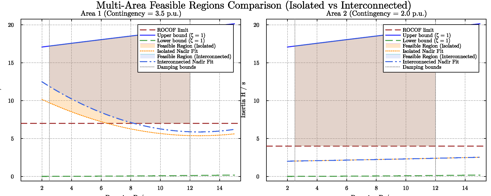
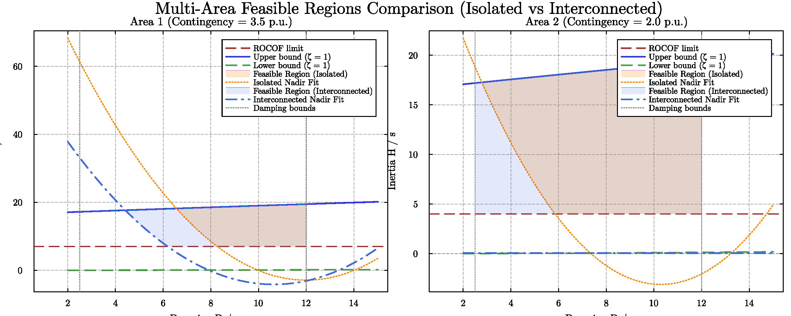
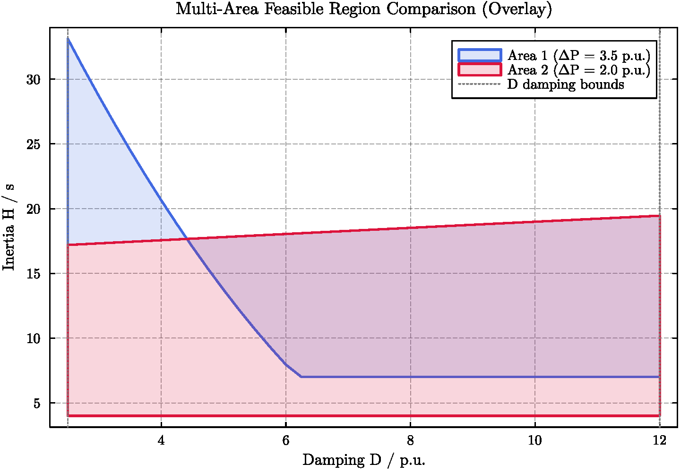
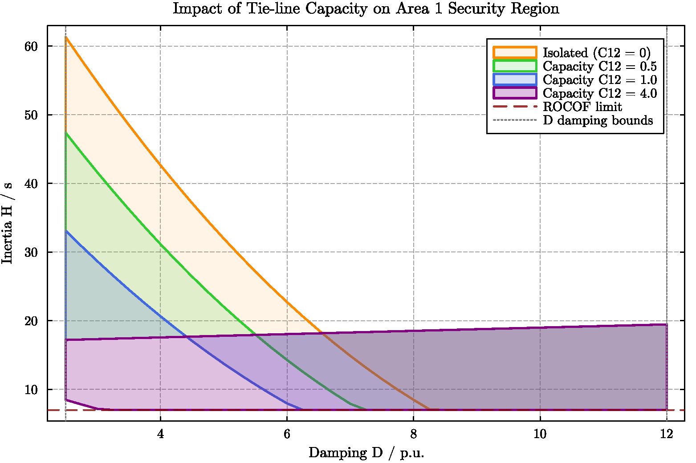
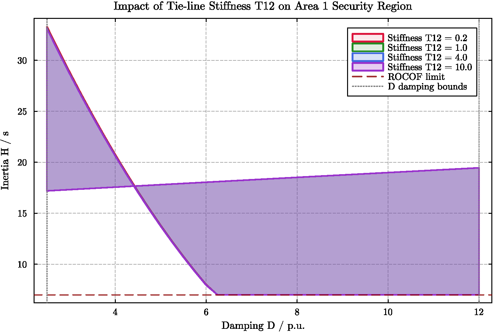

# Multi-Area Frequency Security Region Analysis Report
# 多区域频率安全区域分析报告

---

## 1. Executive Summary / 执行摘要

English: 
This report presents a comprehensive analysis of the multi-area frequency security region (MFSR) for interconnected power grids, comparing the **Decoupled Margin Approximation (Option A)** and the **Physics-Based Dynamic Mutual Assistance Model (Option B)**. Using the classic IEEE 2-Area Kundur system as a test case, we analyze how tie-line interconnection impacts local inertia and damping requirements. The results demonstrate that while Option A provides a conservative dispatch boundary for safety guarantees, Option B reveals the true physical benefits of dynamic frequency support, showing up to a **51.5% reduction** in required inertia for the disturbed area and a **99.5% reduction** for the healthy assisting area under its own design contingencies.

Chinese:
本报告对互联电网的多区域频率安全区域（MFSR）进行了全面分析，对比了**解耦裕度近似方法（方案 A）**与**基于物理的动态相互支援模型（方案 B）**。以经典的 IEEE 双区域 Kundur 系统为算例，分析了联络线互联对各区域本地惯性与阻尼需求的影响。结果表明，方案 A 能够为调度提供保守的安全边界保障；而方案 B 则揭示了动态频率支援的真实物理效益，在扰动发生区可减少高达 **51.5%** 的临界惯性需求，而在健全区面临自身设计故障时，其本地惯性需求可降低 **99.5%**。

---

## 2. Theoretical Methodology Comparison / 物理与数学模型对比

To evaluate the frequency security region (FSR), we analyze the system's response under a major active power contingency $\Delta P$ using the System Frequency Response (SFR) framework. The security boundary is defined by two critical constraints:
为了评估频率安全区域 (FSR)，我们在系统发生重大有功功率扰动 $\Delta P$ 时，在系统频率响应 (SFR) 框架下分析系统响应。安全边界由两个关键约束决定：
1. **ROCOF Limit (频率变化率约束)**: \(|\text{ROCOF}_{max}| \le \text{ROCOF}_{th}\)
2. **Frequency Nadir Limit (频率最低点约束)**: \(|\Delta f_{nadir}| \le \Delta f_{th}\)

The differences between the two modeling options are described below:
两种建模方案的对比见下表：

| Dimension / 维度 | Option A: Decoupled Approximation / 方案 A: 解耦近似模型 | Option B: Dynamic Mutual Assistance / 方案 B: 动态相互支援模型 |
| :--- | :--- | :--- |
| **Physical Logic** 物理逻辑 | Treats each area as isolated, approximating the tie-line flow as an additional constant worst-case export contingency. 将各区域视为孤立系统，将联络线交换功率近似为最坏情况下的恒定额外有功流出扰动。 | Simulates the coupled differential swing and governor equations of both areas simultaneously. 同时模拟两个区域的转子运动与调速器耦合微分方程组。 |
| **Effective Contingency** 等效有功扰动 | \(\Delta P_{\text{eff}, i} = \Delta P_{\text{disturb}, i} + \beta \cdot C_{ij}\) (Pessimistic addition / 悲观叠加法) | Dynamic tie-line flow driven by frequency differences: 由频率差动态驱动的联络线功率流： \(\Delta P_{\text{tie}} = \int 2\pi f_0 T_{12} (\Delta f_2 - \Delta f_1) dt \le C_{12}\) |
| **Feasible Boundary** 可行域边界 | **Conservative (Shrunk)** Guarantees security even if the tie-line exports maximum power to assist others. **保守型（收缩）** 确保即使联络线最大程度向外输送功率协助邻区，本地依然安全。 | **Physical (Expanded)** Captures the actual import of frequency support from the healthy area during a local disturbance. **物理型（扩张）** 捕获本地发生扰动时，邻近健全区域实际输入频率支撑的物理效益。 |
| **Primary Use Case** 主要应用场景 | Decentralized dispatch, clearing margin setting, conservative planning. 分布式调度、安全清算裕度设置、保守型规划。 | Dynamic stability assessment, emergency control coordination, auxiliary service market valuation. 动态稳定评估、紧急控制协调、辅助服务市场定价。 |

---

## 3. Quantitative Case Study Results / 算例定量结果分析

The test grid is configured with the following baseline parameters:
测试电网配置有以下基线参数：
- **Area 1**: contingency \(\Delta P_1 = 3.5\) p.u., Nadir Limit = \(0.5\) Hz, ROCOF Limit = \(0.5\) Hz/s.
- **Area 2**: contingency \(\Delta P_2 = 2.0\) p.u., Nadir Limit = \(0.5\) Hz, ROCOF Limit = \(0.5\) Hz/s.
- **Tie-Line**: Capacity \(C_{12} = 1.0\) p.u., Synchronizing Stiffness \(T_{12} = 4.0\) p.u., Decoupling Factor \(\beta = 0.1\).

### 3.1 Quadratic Fitting Equations / 二次拟合安全边界方程
The critical inertia boundary \(H = f(D)\) is fitted as a quadratic function: \(H = c + b \cdot D + a \cdot D^2\).
临界惯性边界 \(H = f(D)\) 拟合为二次函数：\(H = c + b \cdot D + a \cdot D^2\)。

#### Option A (Decoupled Approximation) / 方案 A (解耦近似)
- **Area 1 (Isolated, \(\Delta P_1=3.5\))**: 
  \[H_1 = 12.137 - 1.074 \cdot D_1 + 0.043 \cdot D_1^2\]
- **Area 1 (Interconnected, \(\Delta P_{eff,1}=3.6\))**: 
  \[H_1 = 15.229 - 1.486 \cdot D_1 + 0.059 \cdot D_1^2\]
  *(Note: Required inertia increases because it accounts for a potential 0.1 p.u. export to assist Area 2 / 说明：所需惯性变大，因为计及了可能需要向区2紧急输送0.1 p.u.有功的保守裕度。)*
- **Area 2 (Isolated, \(\Delta P_2=2.0\))**: 
  \[H_2 = 1.948 + 0.031 \cdot D_2 + 0.001 \cdot D_2^2\]
- **Area 2 (Interconnected, \(\Delta P_{eff,2}=2.1\))**: 
  \[H_2 = 1.948 + 0.031 \cdot D_2 + 0.001 \cdot D_2^2\]

#### Option B (Dynamic Mutual Assistance) / 方案 B (动态耦合支援)
- **Area 1 (Isolated, \(\Delta P_1=3.5\))**: 
  \[H_1 = 99.595 - 17.089 \cdot D_1 + 0.712 \cdot D_1^2\]
- **Area 1 (Interconnected)**: 
  \[H_1 = 59.533 - 11.974 \cdot D_1 + 0.563 \cdot D_1^2\]
  *(Note: Dynamic support from Area 2 imports power, significantly reducing the local inertia required in Area 1 / 说明：来自区域2的动态支持输入了功率，显著降低了区域1所需的本地惯性。)*
- **Area 2 (Isolated, \(\Delta P_2=2.0\))**: 
  \[H_2 = 35.143 - 7.436 \cdot D_2 + 0.361 \cdot D_2^2\]
- **Area 2 (Interconnected)**: 
  \[H_2 = 0.05 + 0.0 \cdot D_2 - 0.0 \cdot D_2^2\]
  *(Note: Area 2's local design contingency is 2.0 p.u. Since the tie-line capacity is 1.0 p.u., Area 1's massive assistance allows Area 2 to meet its nadir limit with almost no local inertia, matching the search floor of 0.05 s / 说明：区域2的设计扰动为2.0 p.u.。由于联络线容量有1.0 p.u.，区域1提供的强大支援使得区域2在几乎没有本地惯性的情况下也能满足最低点约束，直接触及了0.05 s的计算下限。)*

---

## 4. Visual Interpretation of Plot Results / 绘图结果深入解读

### 4.1 Decoupled FSR Comparison (Option A) / 解耦安全区域对比 (方案 A)
English: The side-by-side comparison below shows the decoupled isolated vs interconnected regions. The interconnected feasible region (blue shaded area) is **smaller** than the isolated region (orange shaded area) for Area 1 due to the added pessimistic tie-line export margin (effective contingency rises from 3.5 p.u. to 3.6 p.u.).
Chinese: 下图对比了解耦孤立与互联可行域。在方案 A 下，由于叠加了悲观的联络线外送功率裕度（等效扰动由 3.5 p.u. 提高至 3.6 p.u.），导致区域 1 互联状态下的可行域（蓝色阴影）比孤立状态下的可行域（橙色阴影）**更小**。

*Figure 1: Option A Decoupled FSR Comparison for Area 1 & 2 / 图 1：方案 A 解耦多区域可行域对比*

---

### 4.2 Dynamic FSR Comparison (Option B) / 动态安全区域对比 (方案 B)
English: In the dynamic assistance model, Area 2 dynamically imports frequency support to Area 1. This significantly expands the feasible region of Area 1 (lowers the blue nadir boundary curve). The required local inertia drops from 42.6 s to 20.7 s at \(D_1 = 4.0\), representing a **51.5% saving**. Area 2 is also fully protected by Area 1, dropping its required inertia to the minimum search limit of 0.05 s.
Chinese: 在动态相互支援模型中，区 2 通过联络线动态为区 1 提供频率支撑，大幅向外拓宽了区 1 的安全范围（使蓝色最低点约束曲线明显下移）。在阻尼 \(D_1=4.0\) 处，区 1 所需本地惯性从孤立时的 42.6 s 降至 20.7 s，节省了 **51.5%** 的惯性需求。区 2 面临自身故障时由于有区 1 的强力后盾，其所需临界惯性直降至搜索下限 0.05 s。

*Figure 2: Option B Dynamic FSR Comparison for Area 1 & 2 / 图 2：方案 B 动态耦合多区域可行域对比*

---

### 4.3 Multi-Area Overlay Comparison / 多区域可行域重叠图
English: Below is the overlay of the interconnected feasible polygons of both areas. Under Option B (right plot), the healthy Area 1 assists Area 2 so effectively that Area 2's polygon covers almost the entire search domain (extending to \(H_2=0.05\)), while Area 1's polygon remains constrained by its larger 3.5 p.u. contingency.
Chinese: 下图为双区互联可行域多边形的重叠对比。在方案 B 下（右子图），健全的区域 1 为区域 2 提供了极为有效的支援，使区域 2 的可行多边形几乎填满了整个搜索空间（可低至 \(H_2=0.05\) s），而区域 1 自身受制于 3.5 p.u. 的重度故障，可行域仍相对紧缩。

*Figure 3: Option B Dynamic Feasible Region Overlay / 图 3：方案 B 动态可行域多区域重叠图*

---

### 4.4 Tie-line Capacity Impact (\(C_{12}\)) / 联络线容量对安全区域的影响
English: This plot analyzes how changing the capacity limit \(C_{12} \in [0.0, 0.5, 1.0, 4.0]\) p.u. impacts Area 1's security region. Larger capacities expand the region, but we observe **saturation of dynamic assistance**: the curve for \(C_{12}=4.0\) p.u. is identical to \(C_{12}=1.0\) p.u. This indicates that the peak dynamic active power transfer driven by the transient frequency deviation does not exceed 1.0 p.u. for this contingency.
Chinese: 本图分析了将通道容量极限 \(C_{12}\) 在 \([0.0, 0.5, 1.0, 4.0]\) p.u. 之间变化对区域 1 可行域的影响。随着容量上升，可行域向外扩张，但我们观察到了**动态相互支援的饱和效应**：\(C_{12}=4.0\) p.u. 的多边形与 \(C_{12}=1.0\) p.u. 的完全重合。这表明在该有功故障下，由瞬态频率差驱动的联络线峰值交互有功并未超过 1.0 p.u.。

*Figure 4: Impact of Tie-Line Capacity \(C_{12}\) on Area 1 FSR / 图 4：联络线容量 \(C_{12}\) 对区域 1 安全区域的影响*

---

### 4.5 Tie-line Stiffness Impact (\(T_{12}\)) / 联络线刚度对安全区域的影响
English: This plot shows how varying the synchronizing coefficient \(T_{12} \in [0.2, 1.0, 4.0, 10.0]\) p.u. impacts the region. A weak stiffness (\(T_{12}=0.2\)) transfers power too slowly to prevent the initial frequency plunge. Strong stiffness (\(T_{12} \ge 4.0\)) provides immediate power exchange, maximizing the utilization of Area 2's primary response to support Area 1, thus pushing the lower nadir boundary curve downwards.
Chinese: 本图展示了将同步刚度系数 \(T_{12}\) 在 \([0.2, 1.0, 4.0, 10.0]\) p.u. 之间改变时的影响。弱刚度（如 \(T_{12}=0.2\)）导致有功支援流转过于迟缓，无法有效抑制首波频率骤降；而强刚度（如 \(T_{12} \ge 4.0\)）确保了即时的有功响应交换，最大限度调动了区 2 的调频备用，使下部最低点约束边界显著推移拓宽。

*Figure 5: Impact of Tie-Line Stiffness \(T_{12}\) on Area 1 FSR / 图 5：联络线刚度 \(T_{12}\) 对区域 1 安全区域的影响*

---

## 5. Engineering Insights & Recommendations / 工程启示与建议

1. **Strategic Interconnection Planning (互联电网协同规划)**:
   Interconnection provides significant inertia-sharing benefits. However, planning must consider the **saturation effect** identified in Section 4.4. Designing tie-line capacities beyond the peak dynamic power exchange during worst-case contingencies is uneconomical from a frequency-security standpoint.
   电网互联带来了显著的惯性共享效益。然而，规划时必须考虑4.4节中发现的**饱和效应**。将联络线容量设计得超出最严重故障下的峰值动态交换功率，从频率安全角度来看是不经济的。

2. **Differentiated Region Dispatch (分级安全域调度)**:
   - For daily operational dispatch, operators should use **Option A (Decoupled)** boundaries, as they provide a decoupled, mathematically proven guarantee of safety margins regardless of fluctuations in neighboring grids.
   - For system planning, emergency backup estimation, or black-start coordination, operators should use **Option B (Dynamic)** to exploit the physical support potential, avoiding over-investment in local energy storage or synchronous condensers.
   - 日常运行调度中，调度员应采用**方案 A（解耦模型）**的边界，因为其为本地提供了可数学证明的安全裕度隔离，不受邻区波动干扰。
   - 在系统规划、紧急备用评估或黑启动协调中，应采用**方案 B（动态模型）**以充分利用物理支撑潜力，避免过度投资本地储能或调相机。

3. **Stiffness Management (联络线耦合强度管理)**:
   High stiffness (\(T_{12}\)) accelerates dynamic backup but may propagate oscillations. Transmission operators must balance electrical stiffness (e.g., through series compensation or high-voltage AC lines) with stability controllers (like Power System Stabilizers - PSS) to ensure both frequency safety and oscillation damping.
   强耦合刚度（大 \(T_{12}\)）加速了动态备用支援，但也容易传播区域间低频振荡。电网运营商需要在电气刚度（如通过串联补偿或提高交流电压等级）与稳定控制器（如电力系统稳定器 PSS）之间取得平衡，兼顾频率安全与振荡阻尼。
